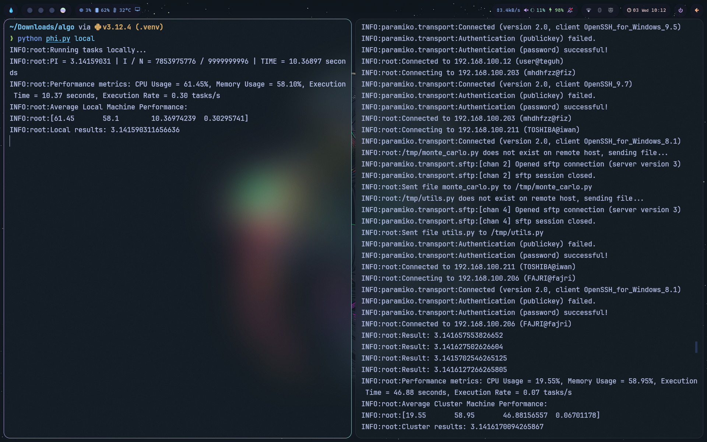

## Program mencari nilai phi menggunakan algoritma Monte Carlo Phi

## 1. Persyaratan
- download [sourcode](https://github.com/mhdhfzz/parallel-computing/archive/refs/heads/main.zip) 
- openssh server (install [link1](https://learn.microsoft.com/en-us/windows-server/administration/openssh/openssh_install_firstuse?tabs=gui)|[link2](https://winaero.com/enable-openssh-server-windows-10/))

start openssh (paste pada terminal atau Powershell)
```bash
  Start-Service sshd
```
- python ([install python](https://www.python.org/downloads/))
- install library python yang digunakan (paste melalu command prompt)
```bash
  pip install paramiko psutil numba numpy matplotlib
```

## 2. Cara menjalankan program
- buka source code melalui [VScode](https://code.visualstudio.com/download)
- atur konfigurasi pada file host.json
1. buka command prompt
2. mendapatkan alamat IP, ketik perintah pada command prompt
```bash
  ipconfig
```
3.  mendapatkan username, ketik perintah pada command prompt
```bash
  echo %username%
```
- buka terminal
- paste perintah berikut pada terminal
1.  cluster machine, untuk running pada cluster machine (dua atau lebih laptop/komputer yang terhubung pada jaringan yang sama)
```bash
  python phi.py cluster
```
2.  local machine, untuk running pada local machine (laptop/komputer yang digunakan)
```bash
  python phi.py local
```

## Hasil

Gambar sebelah kiri run local machine, dan gambar sebelah kanan run cluster machine
